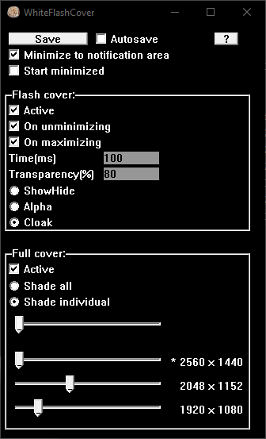

<h2><u>Flash cover</u></h2> (when unminimizing or restoring a window)

When restoring/unminimizing or maximizing a window in Windows theres a brief period of bright blinding light before the dark mode background of the window is rendered. 
This program helps ease that pain. 
Whenever a window is unminimizing or maximizing, this program will make a black window appear in front of that window for a brief moment.  
The cover is only visual so it wont block clicks or anything else. 

Works best with window animations enabled. 

I´ve only tested the program on windows 10 (22H2) but the stories about this issue dates back to earlier Windows versions and Windows 11. 

It works great most of the time, but in certain cases the cover isnt fast enough to cover the glare (e.g. when restoring a browser window with 100+ tabs). The only solution to this that i found (that would probably work) would be to use dll injection to hijack the default actions of every window, which isnt something that i will be adding. 

- The duration of the cover can be adjusted. 100ms worked good for me. 
- The transparency of the cover can be adjusted for a smoother feel (a 100% black cover is kinda noticeable even if just for a brief moment). 
- The cover window doesnt die. When its time for it to go away it just hides. 
How it does this you can also change. You probably wont notice any difference between the latter two but i did find the show/hide mode wonk on me some, so you probably want to stick to the other two. 
    - By show/hide 
    - Changing transparency 0% to (100%) 
    - Cloak/uncloak. 

<h2><u>Screen dimmer</u></h2>

Screen dimmer (by placing a transparent 100% size window on each monitor) with separate control for each monitor. Minimal and works great. Requires restarting the program to detect newly added monitors.  

